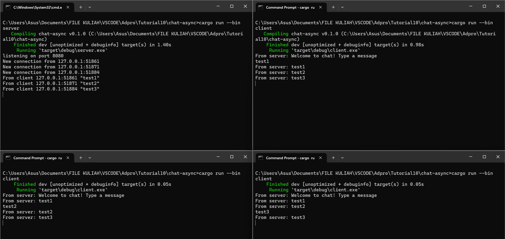

# Advanced Programming - Module 10
#### Reyhan Zada Virgiwibowo - 2206081723 - Advanced Programming C

## 2.1. Original code of broadcast chat


Untuk menjalankan server, saya membuka 1 terminal dengan menjalankan perintah `cargo run --bin server`. Kemudian, untuk menjalankan 3 client, saya membuka 3 terminal dan menjalankan perintah `cargo run --bin client` pada ke 3 terminal tersebut. Masing-masing client terhubung ke 1 server, dimana jika salah satu client mengirimkan pesan ke server, semua client lainnya juga akan menerima response hasil pesan yang dikirim. 

## 2.2. Modifying the websocket port



Untuk mengubah websocket pada client, kode yang harus dirubah adalah:

```rust
    let (mut ws_stream, _) =
    ClientBuilder::from_uri(Uri::from_static("ws://127.0.0.1:8080"))
        .connect()
        .await?;
```

Sedangkan untuk mengubah websocket pada server, kode yang harus diubah adalah:
```rust
   let listener = TcpListener::bind("127.0.0.1:8080").await?;
    println!("listening on port 8080");
```

Client dan juga server harus memiliki port yang sama agar terhubung ke 1 koneksi yang sama. Jika tidak, maka akan terjadi error karena client tidak dapat menemukan port yang tepat.

## 2.3 Small changes. Add some information to client


Dari hasil screenshot, terlihat bahwa terdapat informasi mengenai hostname yaitu Reyhan-M16. Untuk mendapatkan hostname secara otomatis, saya menggunakan dependency `gethostname`. Berikut adalah kode yang mengambil host name:

```rust
...
let hostname = gethostname().into_string().unwrap_or_else(|_| "unknown" to_string());
...
```

Kemudian saya mengaplikasikannya pada print statement di client serta server sehingga menjadi seperti berikut:

client.rs
```rust
...
if let Some(text) = msg.as_text() {
    println!("{}'s computer - From server: {}", hostname, text);
}
...
```

server.rs
```rust
let (socket, addr) = listener.accept().await?;
println!("New connection from {}'s Computer{}", hostname, addr);
```

Dengan demikian, output akan memberikan informasi mengenai siapa yang mengirimkan message.
